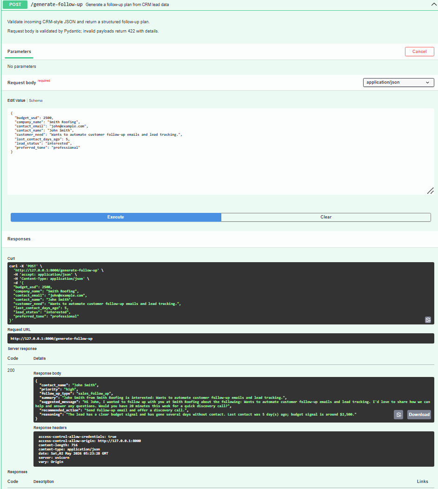

# AI CRM Follow-up Automation

[](https://github.com/vodolij888Igor/ai-crm-follow-up-automation/actions/workflows/tests.yml)

Portfolio backend for **AI Automation Engineer**, **AI Integration Developer**, **Full-Stack AI Product Developer**, and **AI Creator** roles. It exposes a single API that accepts CRM-style lead JSON and returns a structured follow-up plan suitable for human reps or downstream automation.

## Project overview

This service simulates the “brain” of a follow-up assistant: it takes what you know about a lead (name, company, status, need, budget, recency) and returns **priority**, **message draft**, **recommended next action**, and short **reasoning**. **`POST /generate-follow-up` uses the OpenAI API** to analyze the lead and produce a structured, CRM-ready follow-up plan (JSON in / JSON out). There is no database; state is sent on each request.

## Business use case

Sales and success teams lose deals when follow-ups are late, generic, or unprioritized. A small API like this can sit behind a CRM, a scheduling tool, or a workflow engine to:

- Standardize what “good” follow-up looks like for each lead.
- Produce a **draft message** aligned with tone preferences.
- Emit **priority** and **next action** for queues, Slack alerts, or task creation.

## Tech stack

| Layer        | Choice                          |
| ------------ | ------------------------------- |
| API          | [FastAPI](https://fastapi.tiangolo.com/) |
| Validation   | [Pydantic v2](https://docs.pydantic.dev/) |
| Server       | [Uvicorn](https://www.uvicorn.org/) |
| AI           | [OpenAI API](https://platform.openai.com/) (chat completions, JSON output) |
| Config       | `python-dotenv` (`.env`), optional `pydantic-settings` |

## Setup instructions

**Prerequisites:** Python 3.10+ recommended.

1. **Clone or copy** this repository and open a terminal in the project root.

2. **Create and activate a virtual environment**

   - Windows (PowerShell):

     ```powershell
     python -m venv .venv
     .\.venv\Scripts\Activate.ps1
     ```

   - macOS / Linux:

     ```bash
     python3 -m venv .venv
     source .venv/bin/activate
     ```

3. **Install dependencies**

   ```bash
   pip install -r requirements.txt
   ```

4. **Configure OpenAI:** copy `.env.example` to `.env` and set `OPENAI_API_KEY` (required for `POST /generate-follow-up`). Optionally set `OPENAI_MODEL` (defaults to `gpt-4o-mini` if unset).

5. **Run the API**

   ```bash
   uvicorn app.main:app --reload --host 0.0.0.0 --port 8000
   ```

6. **Explore docs:** open [http://127.0.0.1:8000/docs](http://127.0.0.1:8000/docs) for interactive OpenAPI (Swagger UI).

### Running tests

Automated tests mock the OpenAI client—no real API key or network call is required.

```bash
pip install -r requirements.txt
pytest
```

## API

### `POST /generate-follow-up`

Accepts JSON body matching the CRM-style lead shape below.

### Sample request

```http
POST /generate-follow-up HTTP/1.1
Host: 127.0.0.1:8000
Content-Type: application/json

```

```json
{
  "contact_name": "John Smith",
  "contact_email": "john@example.com",
  "company_name": "Smith Roofing",
  "lead_status": "interested",
  "last_contact_days_ago": 5,
  "customer_need": "Wants to automate customer follow-up emails and lead tracking.",
  "budget_usd": 2500,
  "preferred_tone": "professional"
}
```

Example with `curl`:

```bash
curl -s -X POST "http://127.0.0.1:8000/generate-follow-up" ^
  -H "Content-Type: application/json" ^
  -d "{\"contact_name\":\"John Smith\",\"contact_email\":\"john@example.com\",\"company_name\":\"Smith Roofing\",\"lead_status\":\"interested\",\"last_contact_days_ago\":5,\"customer_need\":\"Wants to automate customer follow-up emails and lead tracking.\",\"budget_usd\":2500,\"preferred_tone\":\"professional\"}"
```

On macOS/Linux, use `\` for line continuation instead of `^`.

### Sample response

Wording comes from the model and will vary by lead and prompt; the **response shape** is stable. `priority` is always `low`, `medium`, or `high`. `follow_up_type` is one of: `sales_follow_up`, `re_engagement`, `payment_follow_up`, `onboarding_follow_up`, `support_follow_up`, `general_follow_up`.

```json
{
  "contact_name": "John Smith",
  "priority": "high",
  "follow_up_type": "sales_follow_up",
  "summary": "John Smith from Smith Roofing is interested: Wants to automate customer follow-up emails and lead tracking.",
  "suggested_message": "Hi John, I wanted to follow up with you at Smith Roofing about the following: Wants to automate customer follow-up emails and lead tracking. I'd love to share how we can help and answer any questions. Would you have 20 minutes this week for a quick discovery call?",
  "recommended_action": "Send follow-up email and offer a discovery call.",
  "reasoning": "The lead has a clear budget signal and has gone several days without contact. Last contact was 5 day(s) ago; budget signal is around $2,500."
}
```

The response shape is fixed; text fields are **OpenAI-generated** from your request and the system prompt in `app/services/follow_up_service.py`.

### Errors

| HTTP status | When |
| ----------- | ---- |
| **503** | `OPENAI_API_KEY` is missing or empty (`detail` explains configuration). |
| **502** | OpenAI request failed, or the model returned output that could not be parsed or validated. |

## Screenshot

The screenshot below shows a successful POST /generate-follow-up request in FastAPI Swagger UI with a 200 response.



## API usage examples

Picture a **sales team or agency** managing CRM leads: prospects differ by pipeline stage, budget, days since last touch, and stated needs. To reach the right person at the right time with a coherent message, operators can call **`POST /generate-follow-up`** with structured lead data and receive priority, a draft message, a recommended action, and concise reasoning—without editing spreadsheets ad hoc.

### cURL (`POST /generate-follow-up`)

Run this against a **local** server (`uvicorn` on port **8000**). Set **`Content-Type: application/json`** and send a JSON body with every required field.

```bash
curl -X POST "http://127.0.0.1:8000/generate-follow-up" \
  -H "Content-Type: application/json" \
  -d '{
    "contact_name": "John Smith",
    "contact_email": "john@example.com",
    "company_name": "Smith Roofing",
    "lead_status": "interested",
    "last_contact_days_ago": 5,
    "customer_need": "Wants to automate customer follow-up emails and lead tracking.",
    "budget_usd": 2500,
    "preferred_tone": "professional"
  }'
```

Ensure **`OPENAI_API_KEY`** is configured (see setup instructions); otherwise the API returns **503**. On **Windows PowerShell**, you can run the same URL and headers using **`curl.exe`** with the escaped JSON body shown in the [Sample request](#sample-request) section above, or use Postman below.

### Example successful JSON response

The **`suggested_message`** below is abbreviated (`"..."`); a live response contains the **full model-generated draft**.

```json
{
  "contact_name": "John Smith",
  "priority": "high",
  "follow_up_type": "sales_follow_up",
  "summary": "John Smith is interested in AI automation for follow-up emails and lead tracking.",
  "suggested_message": "...",
  "recommended_action": "Send follow-up email and offer a discovery call.",
  "reasoning": "The lead has a clear business need, an available budget, and has not been contacted for 5 days."
}
```

Exact wording may differ slightly depending on model output and prompts; the **keys** and **value shapes** remain stable.

### Postman

1. Create a new request: **Method** `POST`.
2. **URL:** `http://127.0.0.1:8000/generate-follow-up`
3. **Headers:** add `Content-Type` with value `application/json`.
4. **Body:** choose **raw**, format **JSON**, and paste the same payload structure as in the cURL example (`contact_name`, `contact_email`, `company_name`, `lead_status`, `last_contact_days_ago`, `customer_need`, `budget_usd`, `preferred_tone`).
5. **Send** and verify **200 OK**. In the response JSON, confirm **`contact_name`**, **`priority`**, **`follow_up_type`**, **`summary`**, **`suggested_message`**, **`recommended_action`**, and **`reasoning`** are present and sensible for the lead you submitted.

## Current limitations

- **Requires OpenAI:** You need a valid API key and network access to OpenAI; rate limits and outages surface as **502** responses.
- **No persistence:** Nothing is stored; each request is stateless.
- **No CRM connector:** Leads are simulated by posting JSON; no HubSpot/Salesforce sync.
- **No auth:** Endpoints are open—add API keys or OAuth before production.
- **CORS is permissive:** Suitable for local demos; tighten for deployment.

## Architecture

The API is intentionally small and layered so behavior stays easy to reason about and extend.

- **FastAPI** exposes **`POST /generate-follow-up`** as the single integration surface for client tools and demos.
- **Pydantic** schemas validate **request** and **response** payloads at the boundary (clear errors for malformed input).
- The **service layer** (`app/services/follow_up_service.py`) orchestrates **OpenAI**–based CRM follow-up analysis and structured message generation (priority, type, draft, actions, reasoning).
- **Environment variables** (including **`OPENAI_API_KEY`**) are loaded from **`.env`** via **`python-dotenv`** at startup.
- **Swagger UI** at **`/docs`** provides interactive OpenAPI testing alongside manual clients.
- **Automated tests** mock the AI client so CI and local runs verify HTTP behavior **without** calling OpenAI or requiring secrets.
- This **release** accepts **simulated CRM lead data** as JSON only—there is no live CRM ingestion path yet.

Request flow (high level):

```
Client / Swagger / Postman
        ↓
FastAPI route: POST /generate-follow-up
        ↓
Pydantic validation
        ↓
CRM follow-up service layer
        ↓
OpenAI API
        ↓
JSON response: priority, follow_up_type, summary, suggested_message, recommended_action, reasoning
```

The response also includes **`contact_name`** (echoed for traceability with downstream systems).

## Limitations

- This repository is a **backend portfolio project**, not a full **CRM platform**.
- There is **no database** yet; nothing is persisted between requests.
- **Lead history** is not stored or replayed.
- There is **no user authentication** or tenant model yet.
- There is **no frontend dashboard** yet.
- There is **no integration** with live CRM tools such as **HubSpot**, **Salesforce**, **Pipedrive**, **Airtable**, or **Google Sheets** yet.
- The service does **not send real email**; it returns draft text and recommended actions only.
- It is intended as a **clean, local API demo** suitable for portfolio review and experimentation.
- **Future versions** could add database storage, CRM connectors, outbound email, scheduled follow-ups, authentication, cloud deployment, and a web dashboard—building on this API contract.

## Business Value

This project shows how **CRM-style lead and customer data** can be **analyzed automatically with AI** so teams spend less time deciding what to say next. The API surfaces **priority**, **professional follow-up drafts**, and a **recommended next action**, which helps **reduce missed follow-ups**, **rank urgency**, and keep outreach consistent.

The same architectural pattern can extend to **sales teams**, **agencies**, **service businesses**, **consultants**, **SaaS companies**, **real estate teams**, **home services**, or **any organization** that tracks prospects in a CRM or spreadsheet and needs repeatable follow-up discipline.

## Example Use Cases

- Sales follow-up message generation
- Re-engaging leads that have not responded
- Prioritizing high-value or high-intent leads
- Creating personalized follow-up drafts
- Preparing CRM leads before email outreach
- Supporting sales teams with next-action recommendations
- Reducing missed follow-up opportunities
- Automating lead follow-up workflows

## Future CRM Integration Plan

**Today**, this API accepts **simulated CRM lead payloads as JSON**—there is **no live CRM connector** in this repository.

**A future iteration** could integrate with systems such as **HubSpot**, **Salesforce**, **Pipedrive**, **Airtable**, or **Google Sheets**, reading lead records, interpreting status and timing with AI, generating follow-up copy, and **writing structured results back** into CRM-native fields (for example custom properties or task notes).

Illustrative fields that could be stored downstream—not implemented here—include **`priority`**, **`follow_up_type`**, **`suggested_message`**, **`recommended_action`**, plus operational metadata such as **`assigned_owner`**, **`follow_up_due_date`**, and **`processed_at`**.

Later releases could add **scheduled follow-ups**, **transactional email**, **durable lead history**, **authentication**, **hosted deployment**, and a **frontend dashboard**—still anchored on the same JSON contract this service exposes today.

## Future improvements

- Retries, backoff, and request timeouts tuned per deployment; optional streaming or batched generation.
- Add **OAuth2 / API keys** and rate limiting.
- Persist leads and outcomes in **PostgreSQL** or a CRM webhook pipeline.
- Add **batch generation** and **webhooks** for async CRM workflows.
- Introduce **A/B tone variants** and brand-specific prompt packs.

## Quality checklist

Delivery highlights for reviewers—each item reflects an intentional artifact or outcome in this repository.

- [x] FastAPI backend implemented
- [x] `POST /generate-follow-up` endpoint working
- [x] Real OpenAI API integration added
- [x] Simulated CRM lead data supported through JSON input
- [x] Swagger UI tested successfully
- [x] Screenshot added to README
- [x] API usage examples included
- [x] Automated tests added with pytest
- [x] OpenAI calls mocked in tests
- [x] GitHub Actions CI added
- [x] Environment variables handled with `.env`
- [x] `.env` excluded from GitHub
- [x] Architecture documented
- [x] Limitations documented
- [x] Project pushed to GitHub

## License

Use freely for portfolio and learning; add a license file if you publish publicly.
